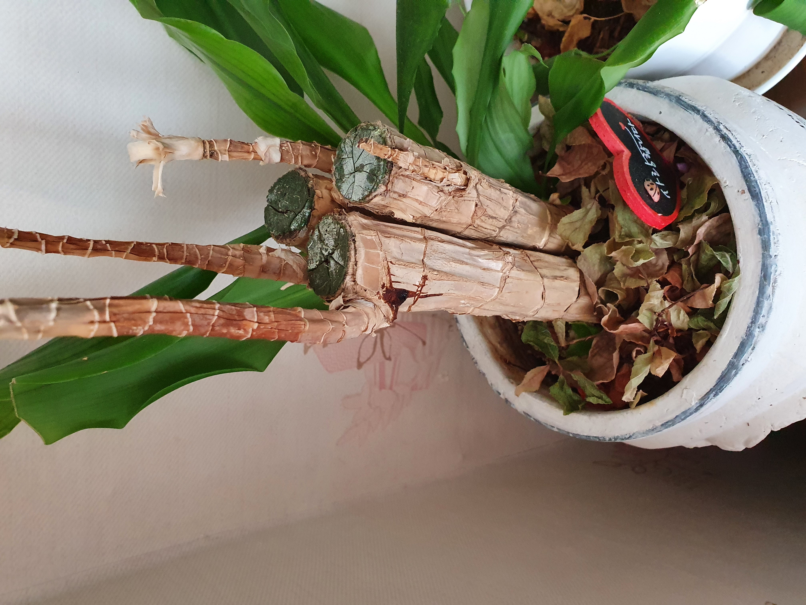

# test -1
깃허브 사용법을 연습합니다

This is an H1
=============

This is an H2
-------------

> 


여기에 원하는 내용을 입력하세요.
>1.사람의 몸  
	1-1.머리  
		1-1-1.뇌  
		  뇌는 말랑말랑하다. 그러하다  
	1-2.다리  
		1-2-1.
		답답  
		1-2-1.
		답답  
		1-2-1. 
		답답  
		1-2-1. 
		답답  
		1-2-1.
		답답
>      ㅇㄴㅁㅊ


  ㅇㄹㄴㅇㄹ  

작성한 소스에 대한 간단한 소개글을 작성합니다.

원하는 내용을 입력하세요.

저장소에 대한 간단한 소개글을 작성합니다.

+ 원격 저장소 만들기
  - origin 연결하기
  - push
  + Pull vs fetch
    * pull
    * fetch
+ 협업하기

한 줄짜리 소스 코드는 `function add(x, y) { return x + y; } ' 처럼 사용합니다

소스 코드 삽입하기
```javascript
  var now = new Date()
 var display = new.toLocaleTimeString()
document.write("현재 시각은 " + display)
```

*single asterisks*
_single underscores_
**double asterisks**
__double underscores__
~~cancelline~~



🇰🇷
